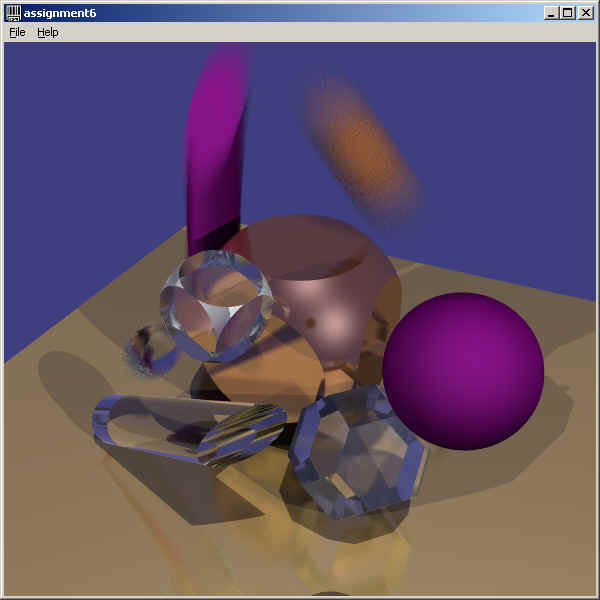

# render

 
  
status: currently porting from a moldy old project to github - cleanup and update as code and docs are added to the project. 
version: 0.55  
progress: utilities libraries and assignments 1, 2, 3, and 4 posted. Simple ray tracing framework posted.  
TODO: see [TODO list](./TODO.md)

## Abstract
This is old ray-tracing code in Java that is easily extensible (good for experimenting with), and makes good images in
reasonable time on today's hardware. The ray-tracing framework supports single sample per pixel, pixel oversampling, and
distributed ray tracing (motion blur, depth of field, area lights, blurred reflection, etc).

### How do I Run this in the Comfort of my Very Own Home?
I work in intellij idea for java development. My project files are included in github, so if you use idea, you have access to
all of my built, run, and test targets. These are the three versions of the ray-tracer:
* Single sample per pixel, multi-threaded:  
    
  <tt>java cip.render.RenderWindow -r cip.render.raytrace.RenderXml -d <i>&lt;sceneDescFile&gt;</i></tt>
  
* Oversampled pixels, multi-threaded (coming soon):
  
  <tt>java cip.render.RenderWindow -r cip.render.raytrace.RenderXmlOS -d <i>&lt;sceneDescFile&gt;</i></tt>
  
* Distributed ray-tracing, multi-threaded (coming soon):
  
  <tt>java cip.render.RenderWindow -r cip.render.raytrace.RenderXmlOSJ -d <i>&lt;sceneDescFile&gt;</i></tt>

where:
* <tt><i>&lt;sceneDescFile&gt;</i></tt> is the scene description file, examples of which are in the resources folder.

## Overview
This is the Java implementation of a ray-tracing renderer framework that supported teaching *3D Rendering Techniques and
Algorithms* (CSE581) at Oregon Graduate Institute (OGI) in 2002, 2003, and 2004. The basic class outline is:
* **Build a Basic Ray Tracer** - Weeks 1-4 are building a simple ray tracer (single file using 3d geometry libraries). The focus
  is on understanding the basics of 3D vector math, geometry, materials, and lighting; without worrying about rendering
  system design.
  * **Instructor's Notes:**
    * The only framework code required for assignments 1-3 are the `cip.render.util`, `cip.render.util2d`,
      and `cip.render.util3d` libraries.
    * Assignment 4 is started with the above libraries, but then transitions to using the ray-tracing framework. In the class
      there was an initial framework that included lights, geometry, materials, and textures that I had written; and a final
      framework that included all of the student-contributed lights, geometry, textures, etc. This is all now in
      `cip.render.raytrace.*`, and this would be a good starting point for having your students extend the libraries with new
      types of geometries, lights, materials, textures, etc.
* **Create (Work in) an Extensible Framework** - cast what was done in the first assignments into an extensible ray-tracing
  framework. Really, this is working in a framework that was created for the class, but, your could create your own framework
  if you thing there is a better way to package things.
* **Extend the Framework** - Add your own extensions to the framework. There are some basic implementations that were part of
  the original class support code, but most of these libraries are student extensions to the basic framework:
  * **Geometry** - Add new geometric objects you want to use in this directory. Originally, this included only a sphere,
    convex polygonal polyhedra, and transformed geometry. Students added full quadric support, and blobbies (see assignment 4)
  * **Lights** - 
  * **Textures** -
  * **Materials** -
* **Better Rendering**
  * **Oversampling**
  * **Distributed Ray Tracing**
  * **Optimization**
* **Do an Independent Project**

The intent was to build an easily extensible system where students could experiment with, test, debug, and prepare for release any
extensions that they thought were interesting - and these extensions to the base could be carried into the next year's
classes. I was blown away by the creativity of my students in this environment. Packaging this
for open source distribution has been a bit of a challenge because I cannot walk you through the course lectures.

## Project Organization
* **render/javadocs** - The javadocs for the project
* **render/resources** - Data files for various environments.
  * **render/resources/test** - Data files intended to test specific components of the framework - geometries, lights,
    materials, textures, etc.
  * **render/resources/website** - Data files that create the images used in the course website. **NOTE**: The assignment
    1-4 images are created by the programs in the **render/src/java/cip/CSE581** directory.
* **render/src/java/cip** - The source code
  * **render/src/java/cip/CSE581** - The reference solutions for the class assignments from assignment 1 to the first
    part of assignment 4. After that, everything is created in the ray tracing framework and the data files for that
    are in the resources folder.
  * **render/src/java/cip/render** - Core interfaces, utility libraries for building a renderer that renders an image
    to an interactive window.
    * **render/src/java/cip/render/raytrace** - Core interfaces, utility libraries, geometries, lights, materials, etc.
      for building ray tracers.
* **render/website** - the updated class website.

## Motivation
I have been writing ray-tracers for a long time - starting at the Cornell Program of Computer Graphics in 1981-1983, progressing
to the renderer for Robert Abel and Associates in 1983-1985, and then to writing the Wavefront Technologies *Image* program
1985-1987 (and through a series of versions, acquisitions, and re-branding; the Wavefront/Alias animation system is
now Maya). I have not done much rendering since then, but every 15 years or so, want to work on it to see what I can bring
to the exercise from my non-rendering pursuits. My last return was for teaching CSE581, this return is because I retired and
recently found the CSE581 code on an old machine, and thought I should revisit it - and that it might be useful to others.

## Specifics
* This project is in single precision because that is was good enough for the images we were creating at the time, and double
  precision was way more time intensive than single precision. If you want to render sub-atomic or astronomical scenes you might
  normalize you objects to the scale in which you are working (nanometers or light years) so you don't experience precision
  problems
